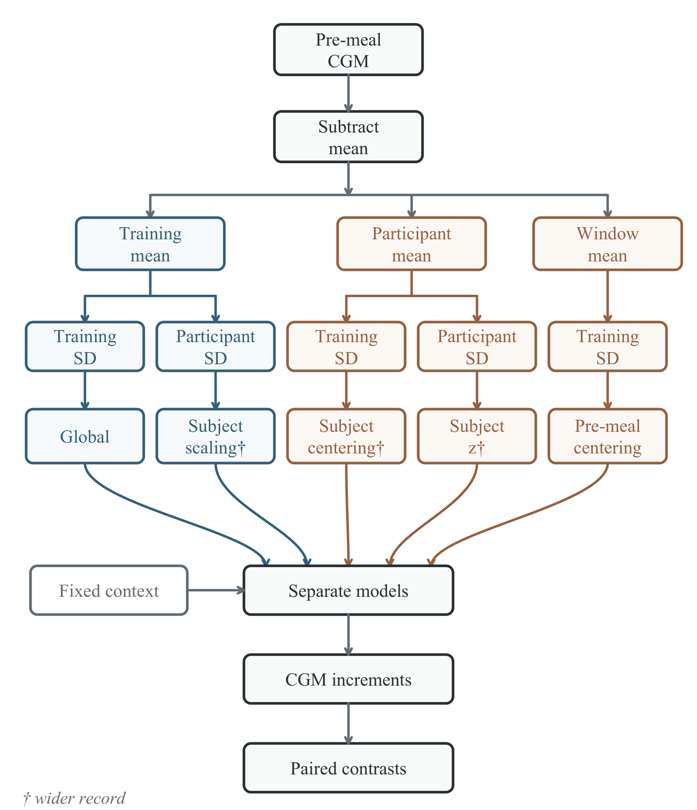

# cgm-normalization-sensitivity

Reproducibility package for:

> **A Normalization-Sensitivity Protocol for Assessing Modality Importance
> in Postprandial Glucose Prediction**
>
> Indriani, Putera, Kartini, Budiman, Nugroho,
> Universitas Lambung Mangkurat

## Background

Continuous glucose monitors (CGMs) record glucose levels throughout the
day. In meal-response prediction, a model receives the CGM readings
from the hour before a meal, along with other information about the
person and the meal, and predicts what glucose will be 30, 60, or 120
minutes later. A natural question is: how much does the CGM input
actually help?

The answer turns out to depend on how the CGM readings are
preprocessed. A common step is **per-subject z-scoring**, which
centers and scales each participant's glucose values to zero mean and
unit variance. This removes the absolute glucose level (e.g., whether
someone started at 90 or 180 mg/dL) and replaces it with a relative
scale. In this study, that single preprocessing choice reduced the
measured contribution of CGM by up to 88%.

This repository provides the data, code, and results to reproduce
every analysis in the paper. It implements a **normalization-sensitivity
protocol**: five controlled versions of the CGM input that isolate
the effects of removing absolute level, rescaling, and using a
participant's record beyond the current input window. By comparing
predictions for the same meals under each version, the protocol
measures how much each preprocessing operation changes the apparent
value of CGM.



## Quick start

```bash
pip install -r requirements.txt

cd core
python e1_run.py          # primary experiment (~30 min, CPU)
python e1_analyze.py      # produces the key result tables
```

Add `--smoke` to any runner for a fast single-seed sanity check.

## The five normalization conditions

| Condition | What it does | Preserves level? | Uses test record? |
|-----------|-------------|:---:|:---:|
| **Global** (reference) | Subtract training-fold mean, divide by training-fold SD | Yes | No |
| **Subject scaling** | Subtract training-fold mean, divide by participant's SD | Yes | Yes |
| **Pre-meal centering** | Subtract current window mean, divide by training-fold SD | No | No |
| **Subject centering** | Subtract participant mean, divide by training-fold SD | No | Yes |
| **Subject z** | Subtract participant mean, divide by participant's SD | No | Yes |

Global and pre-meal centering are leakage-free. The three subject-level
conditions use the held-out participant's extracted windows, including
those from the test fold.

## Repository structure

```
core/                          CGMacros pipeline (40 participants, 913 meals)
  ├── *.npz                    preprocessed data in absolute mg/dL
  ├── fold_splits_tahap1.json  fixed 5-fold participant-level CV splits
  ├── *.py                     experiment and analysis scripts
  └── *.csv, *.json            results and run manifests

normalization_sensitivity/     deep-model and attribution experiments
shanghai_external/             cross-cohort replication (92 participants, 3050 meals)
figures/                       scripts that generate the paper's figures
tables/                        script that generates LaTeX tables
audit/                         traces every manuscript number back to a CSV cell
```

## Experiments

| ID | Question | Scripts (in `core/` unless noted) | Key output |
|----|----------|----------------------------------|------------|
| E1 | Does normalization change what CGM contributes? | `e1_run.py` | `e1_interaction.csv` |
| E2 | Same finding in a deep model? | `normalization_sensitivity/deep_sens_run.py` | `deep_sens_interaction.csv` |
| E2b | Is pre-meal centering enough? | `normalization_sensitivity/deep_sens_pmc_run.py` | `deep_sens_pmc_interaction.csv` |
| E3 | Clinical impact in mg/dL? | `e1_mgdl.py`, `e3_clinical.py` | `e1_mgdl_horizons.csv`, `e3_clinical.csv` |
| E4 | Level or shape: what carries the signal? | `normalization_sensitivity/attr_run.py` | `attr_contrasts.csv` |
| E5 | Is the effect specific to CGM? | `normalization_sensitivity/e5_run.py` | `e5_interaction.csv` |
| Shanghai | Does it replicate in another cohort? | `shanghai_external/shanghai_run.py` | `shanghai_interaction.csv` |

Supplementary experiments (ablation, fusion, attention, window length,
traditional ML, subgroups, simulation, tree-count and meal-exclusion
sensitivity) are in `core/` with self-explanatory filenames.

## Data

| File | Cohort | Meals | Shape of X | Note |
|------|--------|------:|------------|------|
| `core/dexcom_binned_prediction_raw.npz` | CGMacros | 913 | (913, 12, 4) | 5-min bins, 4 channels |
| `core/dexcom_raw_prediction_raw.npz` | CGMacros | 913 | (913, 60, 4) | 1-min resolution |
| `shanghai_external/shanghai_postprandial_raw.npz` | ShanghaiT2DM | 3050 | (3050, 5, 1) | 15-min spacing, CGM only |

Each `.npz` contains:
- `X`: CGM time series (pre-meal windows in absolute mg/dL)
- `static`: participant and meal features
- `y`: glucose targets at 30, 60, and 120 minutes after the meal
- Fold assignments for 5-fold participant-level cross-validation

Normalization statistics are computed at training time using
`foldwise_normalizer.py`, which fits on training-fold participants
only to prevent leakage.

## Cross-directory imports

Scripts in `normalization_sensitivity/` and `shanghai_external/` import
shared modules from `core/` via `sys.path` (`../core`). Keep the three
directories as siblings and the imports resolve.

## Hardware

E1, E3, E4, E5, ablation, traditional ML, simulation, and subgroup
analyses run on **CPU** (Random Forest, 20-30 min each). E2, E2b,
attention, window, and fusion require a **GPU** with TensorFlow.

## Statistical framework

The protocol uses an equivalence-first decision rule. For each
comparison, the 95% confidence interval is checked against a
prespecified margin:

- **NEGLIGIBLE**: the entire CI falls within ±0.02 in ΔR². The
  difference is small enough to ignore.
- **CHANGES**: the CI excludes zero, the Holm-corrected permutation
  p-value is below 0.05, and at least 80% of random seeds agree in
  direction. The normalization made a clear difference.
- **INCONCLUSIVE**: neither condition is met. The data do not support
  a clear conclusion at this sample size.

Confidence intervals use participant-level cluster bootstrap (5,000
resamples). Seeds: 8 for Random Forest, 15 for the deep model. Each
seed runs full 5-fold cross-validation.

## Source datasets

The preprocessed bundles are derived from publicly available data:

- **CGMacros:** https://doi.org/10.17605/OSF.IO/4GXB9
- **ShanghaiT2DM:** https://doi.org/10.6084/m9.figshare.20444633

`preprocessing.py` shows the raw-to-NPZ pipeline; `build_data.py`
documents how the leakage-free bundles were produced.
